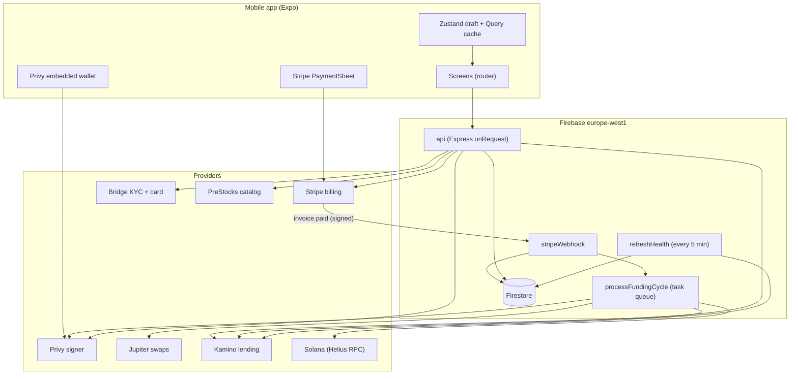
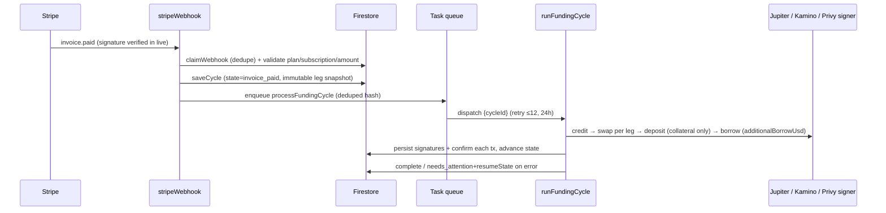
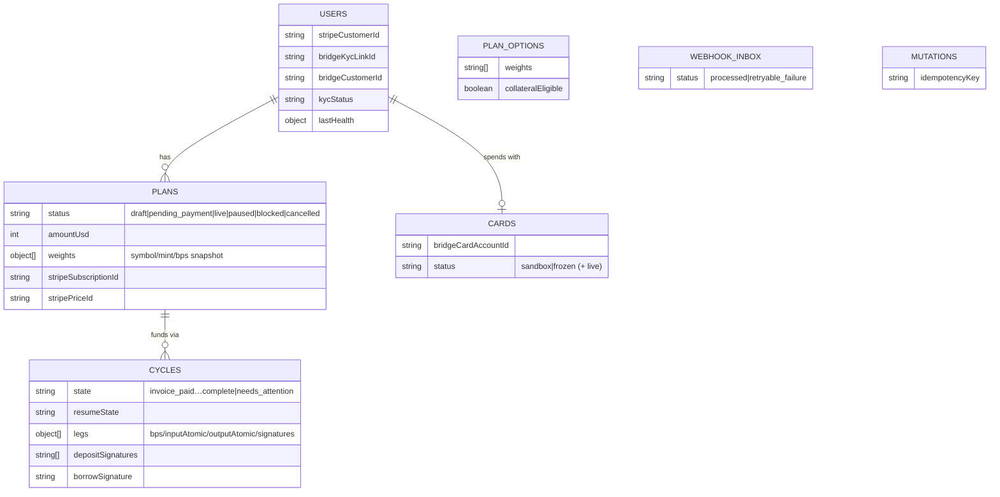
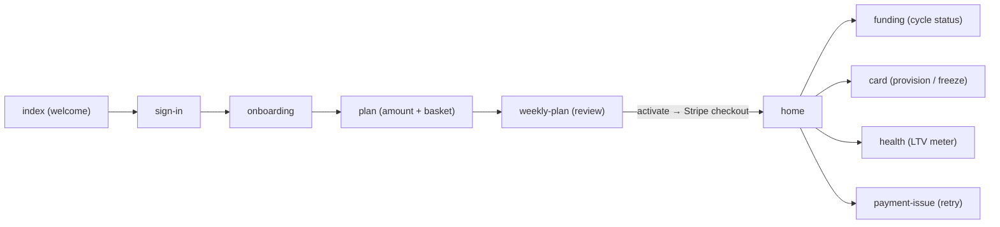
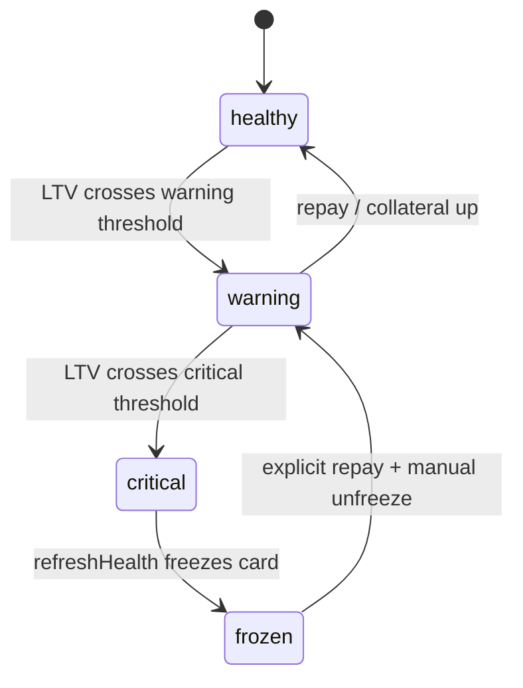

# Pile — Technical Overview

> Weekly card payments → token basket → lending collateral → USDC back on a debit card.
> Demo mode is simulated and fail-closed; live mode (Solana mainnet + real billing/KYC) is gated behind full provider config.

## 1. What it is

- **Product:** user sets a weekly USD amount ($10–$150, $5 steps), pays by card (Stripe subscription). Each `invoice.paid` triggers a funding cycle: USDC credited → swapped into a basket (Jupiter) → deposited as collateral (Kamino) → conservative USDC borrow → spendable on a Bridge debit card.
- **Non-goals:** no seed/private-key custody in app, no balance ledger in Firestore (chain is authoritative), no auto-liquidation/borrow on card auth, no client-driven "buy any amount" endpoint.
- **Modes:** `demo` (in-memory simulated adapters, capped faucet) vs `live` (real Privy/Stripe/Kamino/Jupiter/Bridge/Helius). Mode is selected once in `functions` config; live refuses placeholders.

## 2. Monorepo layout

```
pile-up/
  apps/mobile/            Expo + React Native app (expo-router, NativeWind, Zustand, TanStack Query)
    app/                  File-system routes (index, sign-in, onboarding, plan, weekly-plan, home, funding, card, health…)
    src/components/       ui/ primitives, molecules, organisms (pebble, pile-stack, health-meter)
    src/lib/api.ts        Typed HTTP client for the Functions API (Idempotency-Key per mutation)
    src/stores/app-store.ts  Persisted draft (amount+basket) in SecureStore; plan/card cached per session
    assets/               Single source for icon/adaptive-icon/favicon + pile-logo SVGs
    scripts/generate-brand-assets.cjs  Regenerates all brand PNG/SVG/mipmap assets
  functions/              Firebase Cloud Functions (Node 24, Express, europe-west1)
    src/index.ts          Function entry: `api` (HTTPS), `stripeWebhook`, `refreshHealth` (scheduler), `processFundingCycle` (task queue)
    src/http/app.ts       REST API (~20 routes: plans, billing, funding, cards, identity, health)
    src/webhooks/stripe.ts  Verified Stripe inbox → validates → persists cycle → enqueues task
    src/tasks/funding-cycle.ts  Task-queue worker with retry (12 attempts, 24h window)
    src/workflows/funding-cycle.ts  Durable credit→swap→deposit→borrow state machine
    src/adapters/         Ports/adapters: demo (simulated), stripe-billing, jupiter, bridge-kyc, factory (mode switch)
    src/services/prestocks.ts  Pre-IPO price catalog (mark prices for basket weights)
    src/repository.ts     Firestore access (plans, cycles, users, cards, mutations, webhooks, plan_options)
    src/auth.ts           Privy JWT verify; demo header (`x-pile-demo-user`) only in demo mode
    src/config.ts         Zod env parsing + `assertLiveConfiguration()`
  packages/shared/        Shared domain: types, ports (Wallet/Swap/Lend/Funding/Card), validation, health math, tx policy
  demo/                   Banner + demo video (README assets)
```

**Workspaces:** `pnpm` (`apps/*`, `packages/*`, `functions`). `@pile/shared` is imported by both mobile and functions. Root scripts: `build`, `dev` (Expo Go), `typecheck`, `test`, `lint`.

## 3. Stack

| Layer | Choice |
|---|---|
| Mobile | React Native 0.86 + Expo 57 + expo-router (typed routes), React 19 |
| Styling | NativeWind/Tailwind + `clsx`/`tailwind-merge`, `lucide-react-native`, Reanimated |
| Client state | Zustand (persisted draft) + TanStack Query (server state) |
| Auth (client) | `@privy-io/expo` embedded Solana wallet; `expo-secure-store` for draft |
| Payments (client) | `@stripe/stripe-react-native` (PaymentSheet / portal) |
| Backend | Firebase Functions v2 + Express 4 + `zod` validation + `cors` allow-list |
| DB | Firestore (preferences, checkpoints, cached health — never balances/keys) |
| Chain (live) | Solana via Helius RPC; Jupiter (swaps); Kamino (lend/borrow/health); Privy scoped signer |
| Card/KYC (live) | Bridge (KYC link + card provisioning, sandbox vs live) |
| Billing | Stripe subscriptions + webhooks; portal for payment-method changes |
| Catalog | PreStocks API (pre-IPO marks) merged over static `plan_options` weights |

## 4. System context



## 5. Funding lifecycle (the core loop)

Each weekly payment is a durable `FundingCycle` (`invoice_paid → crediting → credited → swapping → depositing → borrowing → complete`, with `needs_attention + resumeState` on failure). The webhook never runs chain work inline — it persists and enqueues; the task worker resumes from the last checkpoint and never replays completed legs.



Key rules (see `FLOW_RULES.md`): webhook must match subscription metadata/price/currency/amount; client cannot invent a fiat amount; every Solana tx is server-built, policy-checked (owner, programs, mints, max input, recipients) before the scoped Privy signature; borrow proceeds only to the owner's USDC account.

## 6. Backend API surface (grouped, not per-function)

- **Plans:** `GET /v1/plans/options` (Firestore options × PreStocks marks), `POST /v1/plans`, `PATCH /v1/plans/:id` (optimistic `expectedUpdatedAt`), `POST …/activate|pause|resume`, `GET /v1/plans/current`.
- **Billing:** `POST /v1/billing/retry-checkout`, `…/payment-method-session`, `…/payment-method-sync` (live-only portal flow).
- **Funding:** `GET /v1/funding/latest`, `GET /v1/pile` (address + health), `GET /v1/health`.
- **Identity/cards/debt:** `POST /v1/bridge/kyc-session`, `GET /v1/identity/status`, `POST /v1/cards` (+ `POST /v1/cards/:id/freeze`), `POST /v1/debt/repay` (explicit user action only).
- **Cross-cutting:** `requireAuth` on all but options/healthz; CORS allow-list (native has no `Origin`); `Idempotency-Key` claim/complete on every mutation; `404` fallback; `GET /v1/healthz` reports mode.

## 7. Data model (Firestore)

Chain state is authoritative; Firestore holds prefs, IDs, checkpoints, cached health.



Default baskets live in `repository.ts` (`bigfour` xStocks — collateral-eligible; `prestocks` pre-IPO — held in wallet, `NO CARD` because Kamino has no reserves for them).

## 8. Mobile app flow



- `api.ts` attaches `Authorization: Bearer <Privy JWT>` (or `x-pile-demo-user` in Expo Go preview) and a fresh `Idempotency-Key` per mutation.
- `_layout.tsx` wires `PrivyProvider → StripeProvider → QueryClientProvider`; `ApiAuthBridge` clears Query cache + user state on account switch.
- `health-meter` / `pile-stack` render purely from the `/v1/health` + `/v1/pile` snapshot — no duplicated financial math in UI (flow rule 10).

## 9. Health, risk, background jobs



- `Health` = collateral/debt/wallet USDC, current vs max/liquidation LTV, `additionalBorrowUsd`, `cardAvailableUsd` (funded USDC minus reserve — never theoretical capacity).
- `refreshHealth` (5 min): recomputes health per live plan, caches on user, freezes card at `critical`. It never borrows/sells/unfreezes.
- Pre-IPO legs skip Kamino deposits (no reserves) and block card provisioning when the plan has zero collateral-eligible weight.

## 10. Demo vs live

| Concern | Demo | Live |
|---|---|---|
| Wallet/signer | `DemoWalletAdapter` (fake address, scoped sign stub) | Privy embedded signer (live adapters throw until configured) |
| Money in | Capped treasury credit after verified `invoice.paid` (global + per-wallet caps) | Licensed on-ramp/treasury required; Stripe never credits directly |
| Swap/lend | In-memory Jupiter/Kamino stubs | Jupiter Ultra + Kamino + Helius, decoded-tx policy check |
| Card/KYC | `DemoCardAdapter` (`bridge_sandbox`) | Bridge hosted KYC link → approval → provision; freeze supported |
| Auth | `x-pile-demo-user` header accepted | Privy JWT only; demo header rejected |
| Safety | Labeled, fail-closed | `assertLiveConfiguration()` refuses placeholders/missing creds |

## 11. Security invariants (condensed from `FLOW_RULES.md`)

1. Webhook verified (Stripe signature in live), validated, deduplicated before any cycle.
2. Mutations idempotent end-to-end (client key → mutation claim → Stripe/provider keys).
3. Server builds txs; wallet signs scoped; policy asserts owner/programs/mints/recipients/max-input; live decodes serialized tx incl. lookup tables.
4. No secrets client-side (`EXPO_PUBLIC_*` are public config only); no seed/PAN/CVC/balance ledger stored.
5. Explicit user action for repay/deleverage; pause at warning, freeze at critical; no auto-sell on auth.

## 12. Run it

```bash
pnpm install
pnpm dev                                   # Expo Go, demo mode
pnpm --filter @pile/mobile run start:dev-client  # full auth + Stripe
pnpm typecheck && pnpm test                # shared build → recursive checks (vitest in functions)
```

Backend deploys as Firebase Functions (`api`, `stripeWebhook`, `refreshHealth`, `processFundingCycle`) in `europe-west1`; `firestore.rules` + `firestore.indexes.json` ship alongside.
